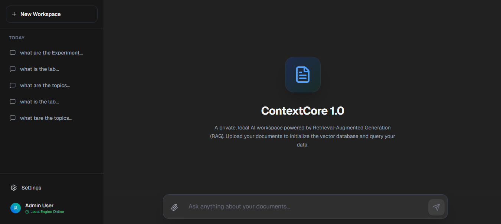
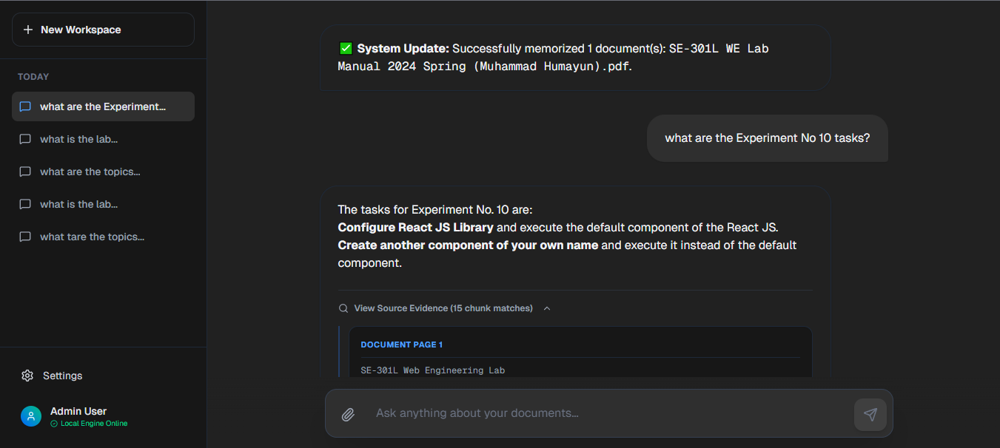
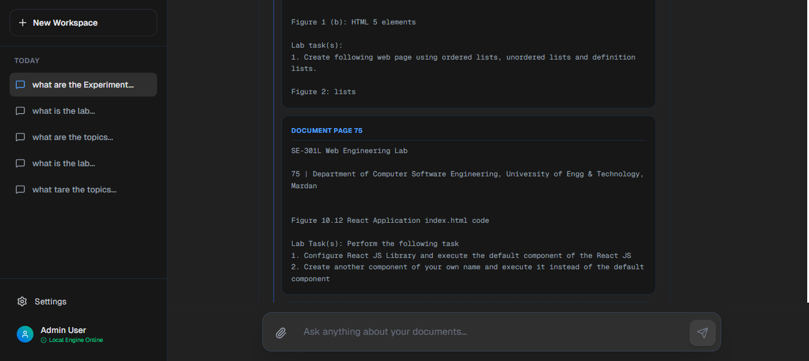

# ContextCore-RAG-AI-Workspace
An enterprise-grade, local Retrieval-Augmented Generation (RAG) workspace for multi-document AI analysis.




An enterprise-grade, local **Retrieval-Augmented Generation (RAG)** workspace. Designed to process complex, multi-page PDFs (such as technical manuals and research papers), this engine allows users to query their personal data with absolute factual transparency.

Unlike standard API wrappers, this project employs a **hybrid architecture**: it utilizes local open-source machine learning models for privacy-preserving vector embeddings, while routing complex semantic reasoning to a cloud-based LLM.

## 🚀 Core Features

*   **Enterprise Source X-Ray:** Built-in hallucination verification. Every AI response includes an interactive dropdown revealing the raw textual chunks and page numbers pulled from the vector database.
*   **Multi-Document Batch Processing:** Highlight and upload multiple PDFs simultaneously into a single, unified vector space.
*   **Local Embedding Pipeline:** Utilizes HuggingFace models locally on the host machine. This eliminates third-party API costs for vectorization and ensures document privacy.
*   **Dynamic Session Management:** Chat histories and active workspaces are automatically categorized by timestamps (Today, Previous 7 Days) using persistent browser storage.
*   **Optimized Chunking Strategy:** Implements a `4000/800` recursive character splitting strategy to maintain context in complex technical manuals.



## 🏗️ Tech Stack

*   **Frontend:** React, Next.js, Tailwind CSS
*   **Backend:** Python, FastAPI, Uvicorn
*   **AI Engine:** LangChain, Google Gemini 2.5 Flash
*   **Vector DB & Embeddings:** ChromaDB, HuggingFace (`all-MiniLM-L6-v2`)



## 🛠️ Local Installation & Setup

To run this application locally, you will need Python 3.10+ and Node.js installed.

### 1. Clone the Repository
```bash
git clone [https://github.com/Usaf007/ContextCore-RAG-AI-Workspace.git](https://github.com/Usaf007/ContextCore-RAG-AI-Workspace.git)
cd  ContextCore-RAG-AI-Workspace
2. Initialize the AI Backend
Create and activate a virtual environment:

On Windows:

Bash
python -m venv venv
venv\Scripts\activate
On Mac/Linux:

Bash
python3 -m venv venv
source venv/bin/activate
Install the required Python dependencies:

Bash
pip install fastapi uvicorn langchain langchain-google-genai langchain-community pypdf chromadb sentence-transformers langchain-huggingface python-multipart
Create a .env file in the root directory and add your LLM API key:

Bash
LLM_API_KEY=your_LLM_api_key
Boot the API Server:

Bash
uvicorn main:app
(The backend will run at [http://127.0.0.1:8000](http://127.0.0.1:8000). The first boot may take a moment to download the HuggingFace model weights locally).

3. Initialize the Frontend UI
Open a secondary terminal and navigate to the frontend directory:

Bash
cd frontend
npm install
npm run dev
Navigate to http://localhost:3000 in your browser to access the UI.

🤝 Contributing
Contributions to ContextCore are welcome. To contribute, please follow the standard fork-and-pull workflow:

Fork the repository on GitHub.

Clone your forked repository to your local machine:

Bash
git clone https://github.com/CONTRIBUTOR-USERNAME/ContextCore-RAG-AI-Workspace.git
cd  ContextCore-RAG-AI-Workspace
Create a Feature Branch for your modifications:

Bash
git checkout -b feature/YourFeatureName
Commit your changes and Push to your fork:

Bash
git add .
git commit -m "Description of your changes"
git push origin feature/YourFeatureName
Open a Pull Request against the main branch of this repository.

Please ensure all modifications are thoroughly tested locally before opening a pull request.

📜 License
Distributed under the MIT License. See LICENSE for more information.

Made with Love ❤️
